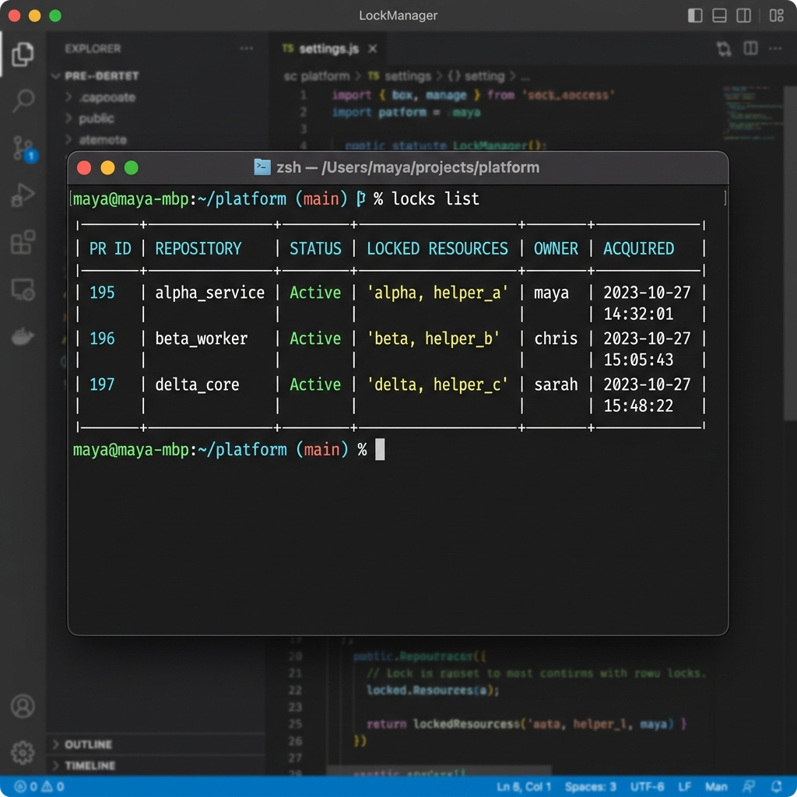
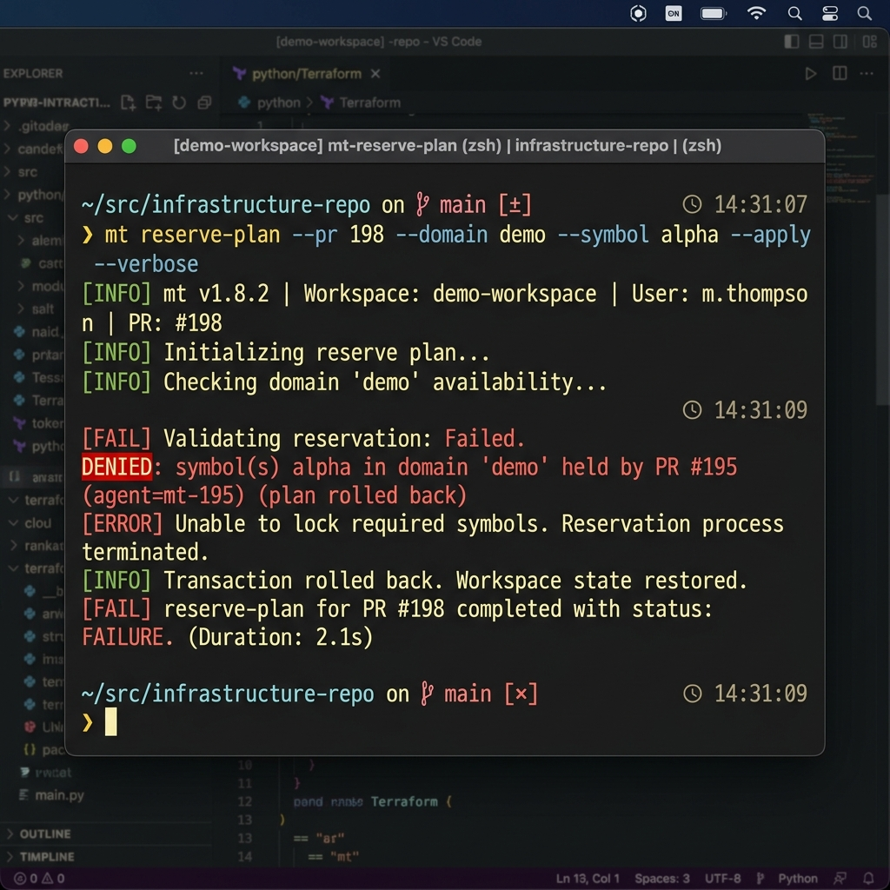
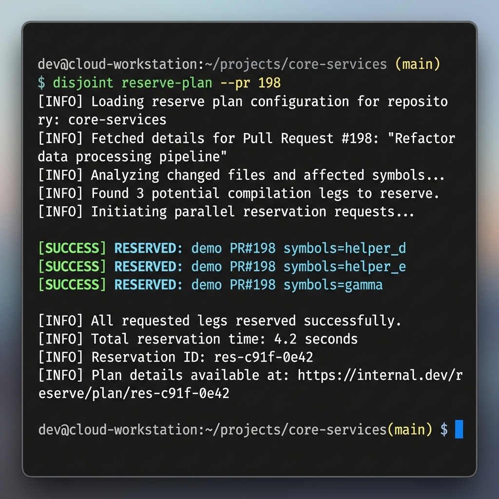

# merge_train V4 reserve-plan Rollback and Retry Evidence

This document records authoritative evidence that the v4 `reserve-plan` command correctly implements atomic, all-or-nothing multi-leg symbol reservation with rollback under contention.

## 🎥 Video Evidence (Mandatory)

The live execution of the saturated state, rollback, and successful retry was captured using asciinema:
- [Asciinema Cast File](reserve_plan_v4_rollback.cast)
- Animated GIF of the session:
  

## 1. Saturated Demo State (Active Locks)

To simulate a realistic concurrent workflow, the lock registry was populated with active locks for the three parallel v3 worker PRs:
- **PR #195 (Worker A3)**: holds `demo::alpha` and `demo::helper_a`
- **PR #196 (Worker B3)**: holds `demo::beta` and `demo::helper_b`
- **PR #197 (Worker C3)**: holds `demo::delta` and `demo::helper_c`


*Figure 1: Saturated active lock registry showing PR #195, #196, and #197.*

```bash
$ domain_lock --registry merge_train_demo/file_domains.yaml --log pr_domain_locks.jsonl list --status active
demo	PR#195	mt-195	mt-test/worker-A3	2026-05-30T19:55:18Z	active	symbols=alpha,helper_a
demo	PR#196	mt-196	mt-test/worker-B3	2026-05-30T19:55:20Z	active	symbols=beta,helper_b
demo	PR#197	mt-197	mt-test/worker-C3	2026-05-30T19:55:20Z	active	symbols=delta,helper_c
```

---

## 2. First Attempt: Contention & Atomic Rollback

Worker rollback (PR #198) attempted to reserve a 3-leg plan containing `demo::helper_d` (free), `demo::helper_e` (free), and `demo::alpha` (deliberately conflicting with PR #195's lock).


*Figure 2: Atomic rollback on PR #198 first attempt due to alpha symbol contention.*

### Plan File (`proofs/plan_rollback_attempt1.yaml`):
```yaml
plan:
  - domain: demo
    symbols:
      - helper_d
  - domain: demo
    symbols:
      - helper_e
  - domain: demo
    symbols:
      - alpha
```

### Execution Command & Output:
```bash
$ domain_lock --registry merge_train_demo/file_domains.yaml --log pr_domain_locks.jsonl reserve-plan --pr 198 --agent mt-198 --branch mt-test/worker-rollback --plan proofs/plan_rollback_attempt1.yaml
DENIED: symbol(s) alpha in domain 'demo' held by PR #195 (agent=mt-195, branch=mt-test/worker-A3) (plan rolled back)
```
The command failed with exit status `1`.

### Verification of Log Entries (Atomic Rollback):
The lock log confirms that the first two legs (`helper_d` and `helper_e`) were initially reserved but immediately released with `note="rollback:reserve_plan"` when the third leg failed, leaving no active locks for PR #198:
```json
{"domain":"demo","pr":198,"agent":"mt-198","branch":"mt-test/worker-rollback","opened_at":"2026-05-30T19:55:25Z","status":"active","closed_at":null,"note":null,"symbols":["helper_d"]}
{"domain":"demo","pr":198,"agent":"mt-198","branch":"mt-test/worker-rollback","opened_at":"2026-05-30T19:55:25Z","status":"active","closed_at":null,"note":null,"symbols":["helper_e"]}
{"domain":"demo","pr":198,"agent":"mt-198","branch":"mt-test/worker-rollback","opened_at":"2026-05-30T19:55:25Z","status":"released","closed_at":"2026-05-30T19:55:25Z","note":"rollback:reserve_plan","symbols":["helper_d"]}
{"domain":"demo","pr":198,"agent":"mt-198","branch":"mt-test/worker-rollback","opened_at":"2026-05-30T19:55:25Z","status":"released","closed_at":"2026-05-30T19:55:25Z","note":"rollback:reserve_plan","symbols":["helper_e"]}
```

---

## 3. Second Attempt: Successful Retry with Disjoint Plan

PR #198 retried with a disjoint 3-leg plan containing `demo::helper_d` (free), `demo::helper_e` (free), and `demo::gamma` (free).


*Figure 3: Successful 3-leg reservation for PR #198 disjoint retry plan.*

### Plan File (`proofs/plan_rollback_attempt2.yaml`):
```yaml
plan:
  - domain: demo
    symbols:
      - helper_d
  - domain: demo
    symbols:
      - helper_e
  - domain: demo
    symbols:
      - gamma
```

### Execution Command & Output:
```bash
$ domain_lock --registry merge_train_demo/file_domains.yaml --log pr_domain_locks.jsonl reserve-plan --pr 198 --agent mt-198 --branch mt-test/worker-rollback --plan proofs/plan_rollback_attempt2.yaml
RESERVED: demo	PR#198	mt-198	mt-test/worker-rollback	2026-05-30T19:55:29Z	active	symbols=helper_d
RESERVED: demo	PR#198	mt-198	mt-test/worker-rollback	2026-05-30T19:55:29Z	active	symbols=helper_e
RESERVED: demo	PR#198	mt-198	mt-test/worker-rollback	2026-05-30T19:55:29Z	active	symbols=gamma
```

### Final Lock Registry Verification:
```bash
$ domain_lock --registry merge_train_demo/file_domains.yaml --log pr_domain_locks.jsonl list --status active
demo	PR#195	mt-195	mt-test/worker-A3	2026-05-30T19:55:18Z	active	symbols=alpha,helper_a
demo	PR#196	mt-196	mt-test/worker-B3	2026-05-30T19:55:20Z	active	symbols=beta,helper_b
demo	PR#197	mt-197	mt-test/worker-C3	2026-05-30T19:55:20Z	active	symbols=delta,helper_c
demo	PR#198	mt-198	mt-test/worker-rollback	2026-05-30T19:55:29Z	active	symbols=helper_d
demo	PR#198	mt-198	mt-test/worker-rollback	2026-05-30T19:55:29Z	active	symbols=helper_e
demo	PR#198	mt-198	mt-test/worker-rollback	2026-05-30T19:55:29Z	active	symbols=gamma
```

All 3 legs of the disjoint plan succeeded atomically and were correctly recorded in the registry log.
